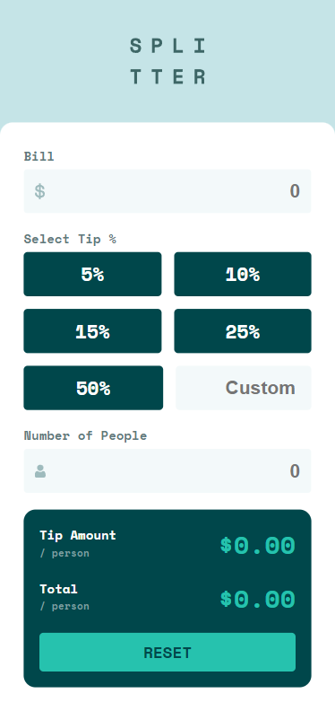
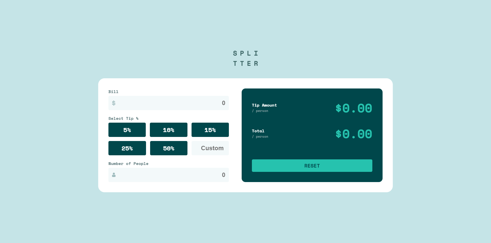

# Frontend Mentor - Tip Calculator solution

This is a solution to the [Tip Calculator challenge on Frontend Mentor](https://www.frontendmentor.io/solutions/responsive-tip-calculator---vanilla-js-bhTi8g244g).

### Screenshot

**Mobile version of the final product**

**Desktop version of the final product**

## My process

### Built with

-   Figma design files
-   Semantic HTML5 markup
-   SCSS custom properties
-   ValidatorJS Library
-   Flexbox
-   Mobile-first workflow
-   BEM Class Methodology

## Author

-   [Portolio](https://www.joshuahovis.com/)
-   [GitHub](https://github.com/joshhovis)
-   [LinkedIn](https://www.linkedin.com/in/joshua-hovis/)
-   [@joshhovis](https://www.frontendmentor.io/profile/joshhovis)
